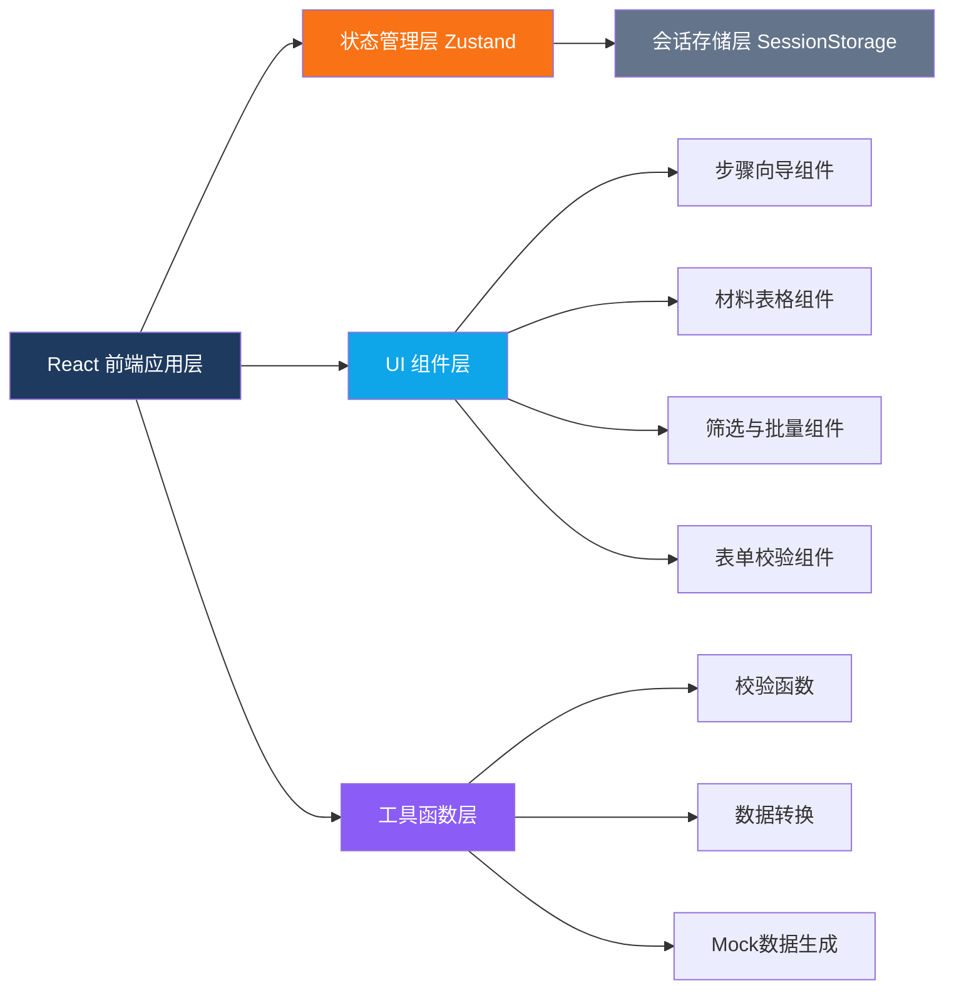
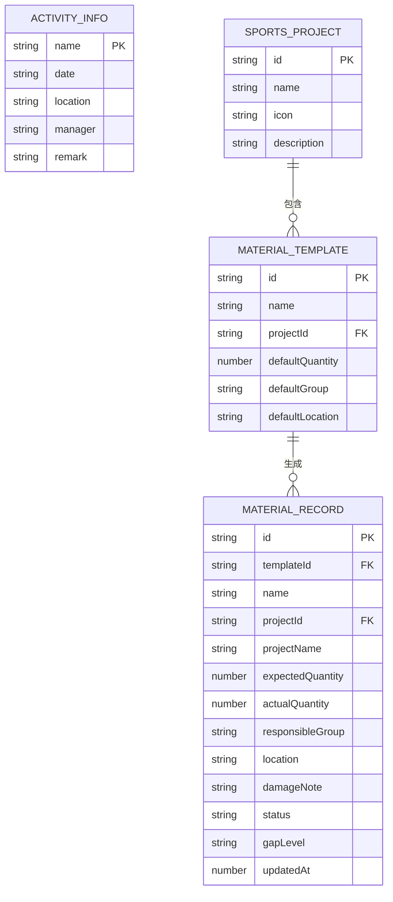

## 1. 架构设计



## 2. 技术说明

- **前端框架**：React@18 + TypeScript + Vite@5
- **样式方案**：Tailwind CSS@3（配合 CSS 变量实现主题）
- **状态管理**：Zustand（集中管理向导步骤、活动信息、材料数据、筛选条件、校验结果）
- **图标库**：Lucide React（线性图标）
- **路由**：React Router DOM（单页面，可选 HashRouter 用于静态部署）
- **持久化**：仅使用浏览器 SessionStorage（刷新清空，符合需求）
- **后端服务**：无（纯前端应用，无需服务器）
- **数据库**：无（全部数据保存在会话内存中）
- **初始数据**：内置 Mock 数据（预设体测项目与材料清单模板）

## 3. 路由定义

| 路由 | 用途 |
|------|------|
| `/` | 主应用页面（四步向导全流程，含角色切换与管理者面板） |
| `/result` | 提交成功结果展示页（可打印/导出摘要） |

## 4. API 定义

本系统为纯前端应用，无后端 API。以下为 TypeScript 类型定义：

```typescript
// 用户角色
type UserRole = 'manager' | 'executor' | 'reviewer';

// 处理状态
type MaterialStatus = 'pending' | 'arrived' | 'need_supply' | 'need_review' | 'suspended';

// 缺口等级
type GapLevel = 'none' | 'low' | 'medium' | 'high';

// 体测项目
interface SportsProject {
  id: string;
  name: string;
  icon: string;
  description?: string;
  materials: MaterialTemplate[];
}

// 材料模板（管理者配置）
interface MaterialTemplate {
  id: string;
  name: string;
  projectId: string;
  defaultQuantity: number;
  defaultGroup?: string;
  defaultLocation?: string;
}

// 材料核对记录（实际使用）
interface MaterialRecord {
  id: string;
  templateId: string;
  name: string;
  projectId: string;
  projectName: string;
  expectedQuantity: number;   // 应到数量
  actualQuantity: number;     // 实到数量
  responsibleGroup: string;   // 负责小组
  location: string;           // 存放点
  damageNote: string;         // 损坏说明
  status: MaterialStatus;     // 处理状态
  gapLevel: GapLevel;         // 缺口等级（自动计算）
  lastEditor?: string;        // 最后编辑人
  updatedAt: number;          // 更新时间戳
}

// 活动信息
interface ActivityInfo {
  name: string;               // 活动名称
  date: string;               // 体测日期
  location: string;           // 举办地点
  manager: string;            // 总负责人
  remark: string;             // 备注
}

// 筛选条件
interface FilterOptions {
  projectIds: string[];
  groups: string[];
  statuses: MaterialStatus[];
  gapLevels: GapLevel[];
  keyword: string;
}

// 校验结果
interface ValidationResult {
  step: number;
  hasError: boolean;
  hasWarning: boolean;
  errors: { field: string; message: string; recordId?: string }[];
  warnings: { field: string; message: string; recordId?: string }[];
}

// 全局应用状态
interface AppState {
  role: UserRole;
  currentStep: number;
  activityInfo: ActivityInfo;
  selectedProjectIds: string[];
  materialRecords: MaterialRecord[];
  projects: SportsProject[];
  presetGroups: string[];
  filters: FilterOptions;
  selectedRecordIds: string[];
  validations: ValidationResult[];
  isSubmitted: boolean;
  reviewNote: string;
  reviewerName: string;
}
```

## 5. 数据模型（会话存储结构）



## 6. 核心模块划分

### 6.1 项目目录结构

```
src/
├── components/
│   ├── layout/
│   │   ├── Header.tsx           # 顶部导航与角色切换
│   │   └── StepIndicator.tsx    # 步骤条指示器
│   ├── wizard/
│   │   ├── Step1Activity.tsx    # 第一步：活动信息
│   │   ├── Step2Projects.tsx    # 第二步：项目选择
│   │   ├── Step3Materials.tsx   # 第三步：材料核对
│   │   └── Step4Review.tsx      # 第四步：复核确认
│   ├── materials/
│   │   ├── MaterialTable.tsx    # 材料表格
│   │   ├── MaterialRow.tsx      # 材料行（可编辑）
│   │   ├── FilterBar.tsx        # 筛选工具栏
│   │   ├── BatchActionBar.tsx   # 批量操作条
│   │   └── MaterialEditor.tsx   # 行内编辑模态框
│   ├── manager/
│   │   ├── ManagerPanel.tsx     # 管理者面板
│   │   ├── ProjectEditor.tsx    # 项目编辑器
│   │   └── MaterialTemplateEditor.tsx  # 材料模板编辑
│   └── common/
│       ├── Button.tsx           # 通用按钮
│       ├── Input.tsx            # 通用输入框
│       ├── Select.tsx           # 通用下拉框
│       ├── Tag.tsx              # 状态标签
│       ├── Modal.tsx            # 模态框
│       ├── Toast.tsx            # 全局提示
│       └── EmptyState.tsx       # 空状态
├── stores/
│   ├── useAppStore.ts           # Zustand 全局状态
│   └── useWizardStore.ts        # 向导流程状态（可选合并）
├── hooks/
│   ├── useValidation.ts         # 校验逻辑 Hook
│   ├── useFilters.ts            # 筛选逻辑 Hook
│   └── useBatchActions.ts       # 批量操作 Hook
├── utils/
│   ├── validation.ts            # 校验函数集合
│   ├── gapCalculator.ts         # 缺口等级计算
│   ├── mockData.ts              # 初始化 Mock 数据
│   └── helpers.ts               # 通用工具函数
├── types/
│   └── index.ts                 # 全局类型定义
├── pages/
│   ├── HomePage.tsx             # 主页面
│   └── ResultPage.tsx           # 提交结果页
├── styles/
│   └── globals.css              # 全局样式与 Tailwind 覆盖
├── App.tsx
├── main.tsx
└── vite-env.d.ts
```

### 6.2 校验规则定义

| 步骤 | 校验项 | 规则 | 级别 |
|------|--------|------|------|
| 第一步 | 活动名称 | 不能为空，长度 ≤ 50 | Error |
| 第一步 | 体测日期 | 不能为空，格式为有效日期 | Error |
| 第一步 | 举办地点 | 不能为空，长度 ≤ 100 | Error |
| 第一步 | 总负责人 | 不能为空，长度 ≤ 20 | Error |
| 第二步 | 项目选择 | 至少选择 1 个项目 | Error |
| 第三步 | 实到数量 | 必须 ≥ 0，且为整数 | Error |
| 第三步 | 数量对比 | 实到 < 应到时需填写损坏说明或选择"需补充"状态 | Warning |
| 第三步 | 负责小组 | 必填，不能为空 | Error |
| 第三步 | 存放点 | 必填，不能为空 | Error |
| 第三步 | 损坏说明 | 当状态为"暂停使用"或实到<应到时必填 | Error |
| 第四步 | 复核签名 | 提交前不能为空 | Error |
| 全流程 | 所有记录 | 所有 Error 级别问题修正后方可最终提交 | Block |
