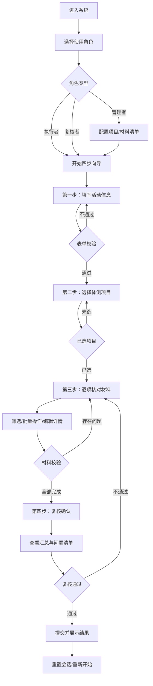

## 1. 产品概述

体测材料核对系统是一款面向高校/机构体测活动的浏览器端材料管理工具，通过阶梯式向导引导使用者完成活动信息录入、项目选择、材料逐项核对和最终复核全流程。系统采用会话级数据存储，无需登录和服务器，解决体测活动中材料到位情况核对效率低、责任不清、状态混乱等问题。

- **目标用户**：体测管理者、执行人员、复核人员
- **核心价值**：标准化材料核对流程，明确责任归属，实时校验问题，大幅提升体测准备工作效率

## 2. 核心功能

### 2.1 用户角色

| 角色 | 登录方式 | 核心权限 |
|------|----------|----------|
| 管理者 | 无需登录，会话内切换角色 | 维护体测项目配置、材料清单模板，查看整体核对进度 |
| 执行者 | 无需登录，会话内切换角色 | 填写材料实到数量、损坏情况、负责人信息，执行批量状态标记 |
| 复核者 | 无需登录，会话内切换角色 | 确认最终核对结果，标记复核通过/需返工 |

### 2.2 功能模块

1. **角色切换面板**：顶部角色选择器，切换管理者/执行者/复核者视图
2. **阶梯式向导（四步）**：
   - 第一步：活动信息填写（活动名称、日期、地点、负责人）
   - 第二步：体测项目选择（多选项目，关联对应材料清单）
   - 第三步：材料逐项核对（表格形式，支持筛选、批量操作）
   - 第四步：复核确认（汇总统计、问题清单、最终提交）
3. **材料管理（管理者）**：增删改体测项目及其对应材料清单
4. **校验提示系统**：步骤条状态标记、必填项红框、数量异常高亮、损坏说明缺失提醒
5. **筛选与批量操作**：按项目/小组/状态/缺口等级筛选，批量标记状态
6. **会话级草稿**：切换步骤自动保留内容，刷新页面清空数据

### 2.3 页面详情

| 页面名称 | 模块名称 | 功能描述 |
|----------|----------|----------|
| 主页面（单页应用） | 顶部导航栏 | 品牌Logo、角色切换器、会话重置按钮 |
| 主页面 | 步骤条组件 | 四步进度指示器、当前步骤高亮、校验状态图标（警告/错误/完成） |
| 主页面 | 第一步-活动信息 | 表单字段：活动名称、体测日期、举办地点、总负责人、备注说明 |
| 主页面 | 第二步-项目选择 | 可折叠项目卡片、项目多选、材料清单预览、已选材料统计 |
| 主页面 | 第三步-材料核对 | 筛选工具栏（项目/小组/状态/缺口）、批量操作按钮组、可编辑材料表格、行内编辑模态框 |
| 主页面 | 第四步-复核确认 | 数据汇总卡片、问题分类列表、复核意见输入、提交确认按钮、成功结果页 |
| 主页面 | 管理者面板 | 项目CRUD、材料模板编辑、预设小组管理 |
| 主页面 | 全局提示 | Toast通知、表单错误气泡、空状态插图 |

## 3. 核心流程

用户进入系统后选择角色，若为管理者先配置项目和材料清单；所有角色均按四步向导顺序操作：填写活动基础信息 → 勾选本次体测涉及的项目 → 逐条核对材料实到情况并填写损坏/负责人信息 → 复核全部数据后提交。切换步骤时自动保存当前输入到会话状态，可随时返回修改；步骤条实时显示各步骤校验状态，存在问题的步骤标红提示，直到全部修正后方可提交最终结果。

## 4. 用户界面设计

### 4.1 设计风格

- **主色与辅色**：主色采用沉稳的藏青色 `#1e3a5f`（代表专业与责任），辅色使用活力橙 `#f97316`（强调操作与警告），成功绿 `#10b981`，危险红 `#ef4444`，中性灰采用 slate 色系
- **按钮风格**：圆角 8px，主按钮采用渐变填充+微投影，次按钮采用描边+悬停底色过渡，危险按钮采用红色系强调
- **字体排版**：标题采用「思源黑体 CN」Bold 700，正文采用「思源黑体 CN」Regular 400；字号层级：页面大标题 28px、步骤标题 20px、卡片标题 16px、正文 14px、辅助文字 12px
- **布局风格**：卡片式布局配合 12 栅格系统，步骤区与内容区分层清晰，表格区采用固定表头+内部滚动方案
- **图标与视觉**：使用 Lucide React 图标库（线性风格），状态标签配合彩色圆点，空状态与完成页使用 SVG 插图增强情感化

### 4.2 页面设计概览

| 页面名称 | 模块名称 | UI元素 |
|----------|----------|--------|
| 主页面 | 顶部导航栏 | 左侧Logo+标题（渐变文字）、中间角色切换Tab（胶囊式）、右侧重置按钮（带确认弹窗） |
| 主页面 | 步骤条 | 横向时间轴样式，步骤圆圈+连接线，完成步骤打勾、当前步骤高亮描边、有问题步骤显示三角警告图标、步骤名称下方显示校验摘要 |
| 主页面 | 第一步表单 | 两列表单栅格，输入框带浮动标签，日期选择器带日历图标，备注为多行文本域，底部显示必填项计数 |
| 主页面 | 第二步项目卡片 | 网格布局（每行3张），卡片含项目名、图标、材料数量角标、勾选框、展开后显示材料列表预览，底部悬浮栏显示已选统计与下一步按钮 |
| 主页面 | 第三步材料表格 | 顶部筛选栏（标签式筛选器+搜索框），批量操作条（悬浮出现），表格行斑马纹+悬停高亮，行内数量输入带加减按钮，状态下拉带色彩标签，异常单元格红色描边+工具提示 |
| 主页面 | 第四步复核页 | 三列统计卡片（材料总数/已到位/待处理）、分类折叠面板（按缺口/损坏/缺失分组）、复核签名输入框、提交按钮带加载动画 |
| 主页面 | 管理者面板 | 左右分栏：左侧项目列表（可拖拽排序），右侧编辑区（项目信息+材料清单表格+新增材料行） |

### 4.3 响应式策略

- **设计原则**：桌面端优先（体测核对工作主要在办公电脑完成），平板自适应，移动端简化操作
- **断点设置**：≥1280px 三列布局，≥768px 两列布局，<768px 单列堆叠布局
- **触屏优化**：移动端表格改为卡片列表，行内操作改为底部弹出抽屉，按钮最小触控区域 44×44px

### 4.4 交互动效

- 步骤切换采用左右滑入+淡入过渡（300ms ease-out）
- 表格行编辑时展开行内编辑区（高度过渡动画）
- 批量操作条在勾选后从底部滑入
- 校验错误输入框轻微抖动动画（shake）
- 提交成功后显示彩屑动画（canvas confetti）
